# Actividad: Manipulación de Datos en la Empresa DBMONEY

**Módulo:** Sistemas de Gestión Empresarial  
**Unidad:** UD3 - Organización y consulta de la información  
**Alumno:** Santiago Lafuente Hernández
**Curso:** 2º DAM

---

## Índice

1. [Introducción](#1-introducción)
2. [Instalación de pgAdmin](#2-instalación-de-pgadmin)
3. [Conexión a PostgreSQL de Odoo](#3-conexión-a-postgresql-de-odoo)
4. [Creación de Nueva Empresa en Odoo](#4-creación-de-nueva-empresa-en-odoo)
5. [Localización de Tablas en pgAdmin](#5-localización-de-tablas-en-pgadmin)
6. [Instalación de Módulo y Verificación de Tablas](#6-instalación-de-módulo-y-verificación-de-tablas)
7. [Consultas SQL y Exportación de Datos](#7-consultas-sql-y-exportación-de-datos)
8. [Generación de Formularios e Informes en Odoo](#8-generación-de-formularios-e-informes-en-odoo)
9. [Automatización de Extracción de Datos](#9-automatización-de-extracción-de-datos)
10. [Verificación del Rendimiento del Sistema](#10-verificación-del-rendimiento-del-sistema)
11. [Auditoría de Datos](#11-auditoría-de-datos)
12. [Registro de Incidencias](#12-registro-de-incidencias)
13. [Conclusiones](#13-conclusiones)

---

## 1. Introducción

La empresa **DBMONEY Mantenimiento Industrial S.L.** es una compañía ficticia dedicada al mantenimiento preventivo y correctivo de maquinaria industrial. Utiliza Odoo como sistema ERP-CRM para gestionar sus operaciones de negocio, incluyendo proyectos de mantenimiento, inventario de repuestos y relaciones con clientes.

El objetivo de esta práctica es realizar una auditoría de calidad de datos a nivel de base de datos PostgreSQL, complementando las verificaciones que se pueden hacer desde la interfaz de Odoo. Esta auditoría permite:

- Verificar la integridad de los datos almacenados
- Comprobar la estructura de tablas creadas por los módulos
- Identificar posibles inconsistencias o problemas de rendimiento
- Documentar el estado del sistema ERP

Esta auditoría es similar a las que se realizan en entornos industriales reales, donde el departamento de calidad requiere trazabilidad completa de los datos del sistema.

---

## 2. Instalación de pgAdmin

### 2.1 Descarga e Instalación

**pgAdmin** es la herramienta oficial de administración para PostgreSQL. Permite gestionar bases de datos, ejecutar consultas SQL y monitorizar el rendimiento del servidor.

**Pasos de instalación en Windows:**

1. Acceder a la web oficial: https://www.pgadmin.org/download/
2. Seleccionar **Windows** y descargar la última versión estable
3. Ejecutar el instalador `pgadmin4-x.x-x64.exe`
4. Seguir el asistente de instalación:
    - Aceptar términos de licencia
    - Seleccionar directorio de instalación (por defecto: `C:\Program Files\pgAdmin 4`)
    - Completar la instalación

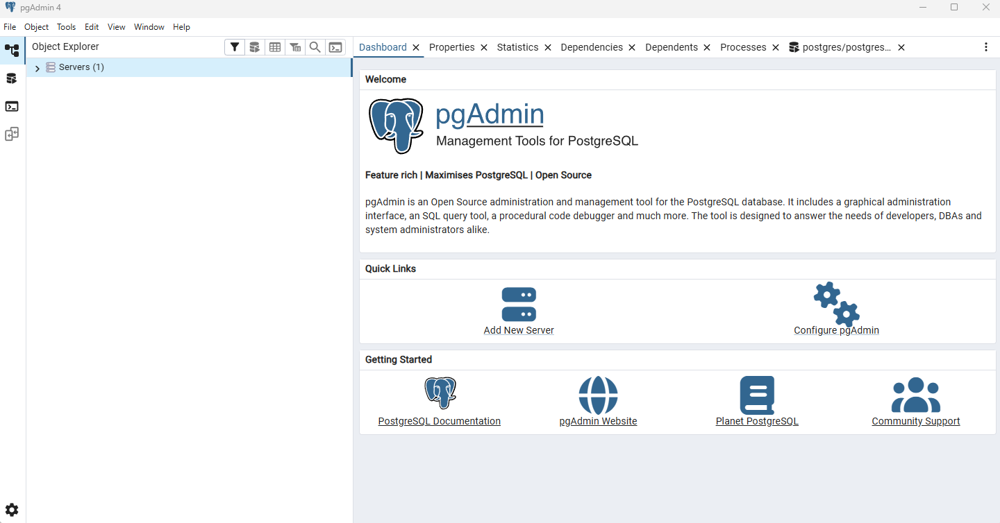

### 2.2 Primer Inicio

Al abrir pgAdmin por primera vez:

1. Se solicitará crear una **contraseña maestra** (master password)
2. Esta contraseña protege las credenciales guardadas de los servidores
3. Guardar esta contraseña en un lugar seguro


### 2.3 Verificación de Instalación

Una vez instalado, pgAdmin se ejecuta como aplicación de escritorio:

- Abrir desde: Menú Inicio → pgAdmin 4 → pgAdmin 4
- Se abre en su propia ventana, no en navegador

---

## 3. Conexión a PostgreSQL de Odoo

### 3.1 Datos de Conexión

Para conectar pgAdmin a la base de datos de Odoo, necesitamos los siguientes datos:

| Parámetro | Valor típico | Descripción |
|-----------|--------------|-------------|
| Host | `localhost` o `127.0.0.1` | Servidor donde corre PostgreSQL |
| Puerto | `5432` | Puerto por defecto de PostgreSQL |
| Usuario | `odoo` o `postgres` | Usuario de base de datos |
| Contraseña | (la configurada) | Contraseña del usuario |

> **Nota:** Estos datos se configuraron durante la instalación de Odoo. Si usamos Docker, el puerto puede variar.

### 3.2 Crear Nueva Conexión de Servidor

1. En pgAdmin, clic derecho en **Servers** → **Register** → **Server...**

2. **Pestaña General:**
    - Name: `Odoo PostgreSQL Server`

3. **Pestaña Connection:**
    - Host name/address: `localhost`
    - Port: `5432`
    - Maintenance database: `postgres`
    - Username: `odoo` (o el usuario configurado)
    - Password: (introducir contraseña)
    - Marcar "Save password" para no introducirla cada vez

4. Clic en **Save**


### 3.3 Verificación de Conexión

Si la conexión es exitosa:
- El servidor aparecerá en el árbol de navegación
- Podremos expandir para ver las bases de datos existentes
- Las bases de datos de Odoo aparecerán listadas

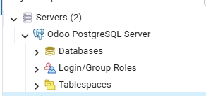

### 3.4 Posibles Problemas de Conexión

| Problema | Causa | Solución |
|----------|-------|----------|
| Connection refused | PostgreSQL no está ejecutándose | Iniciar servicio PostgreSQL |
| Authentication failed | Credenciales incorrectas | Verificar usuario/contraseña en odoo.conf |
| Could not connect | Firewall bloqueando | Permitir puerto 5432 en firewall |

---

## 4. Creación de Nueva Empresa en Odoo

### 4.1 Acceso a Odoo

1. Abrir navegador web
2. Acceder a: `http://localhost:8069` (o el puerto configurado)
3. Si ya existe una base de datos, acceder al gestor de bases de datos:
    - URL: `http://localhost:8069/web/database/manager`

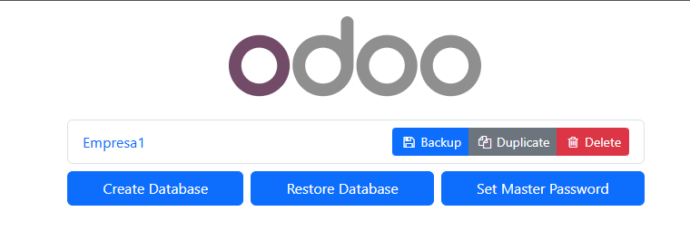

### 4.2 Crear Nueva Base de Datos (Empresa)

En el gestor de bases de datos, clic en **Create Database**:

| Campo | Valor | Descripción |
|-------|-------|-------------|
| Master Password | (contraseña maestra) | Configurada en instalación de Odoo |
| Database Name | `dbmoney_mantenimiento` | Nombre identificativo sin espacios |
| Email | `admin@dbmoney.com` | Email del administrador |
| Password | `admin123` | Contraseña del usuario admin |
| Phone number | (opcional) | Teléfono de contacto |
| Language | Spanish (ES) / Español | Idioma de la interfaz |
| Country | Spain | País de la empresa |
| Demo data | ☑ Marcar | Incluir datos de demostración |

> **Importante:** Marcar "Demo data" nos proporcionará datos de ejemplo para realizar la auditoría.

Clic en **Create Database** y esperar a que se complete el proceso.

### 4.3 Configuración Inicial de la Empresa

Una vez creada la base de datos, Odoo nos redirige al asistente de configuración:

1. **Datos de la empresa:**
    - Nombre: DBMONEY Mantenimiento Industrial S.L.
    - Dirección: Polígono Industrial Norte, Nave 42
    - Ciudad: Valencia
    - NIF: B12345678

2. **Módulos iniciales recomendados:**
    - CRM (Gestión de clientes)
    - Inventario (Control de repuestos)
    - Contactos

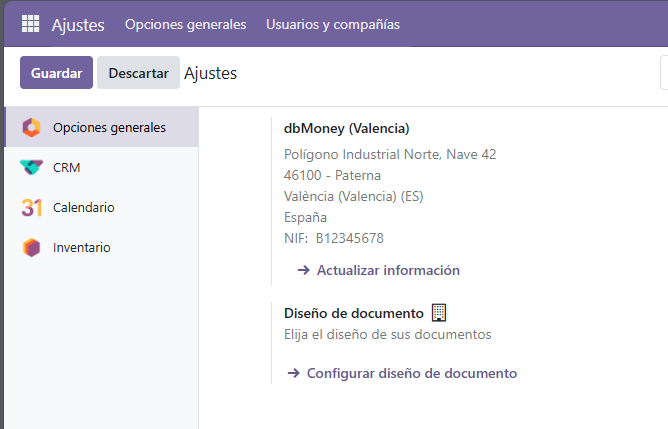
---

## 5. Localización de Tablas en pgAdmin

### 5.1 Verificar Nueva Base de Datos

Después de crear la empresa en Odoo, en pgAdmin:

1. Clic derecho en **Databases** → **Refresh**
2. Aparecerá la nueva base de datos: `dbmoney_mantenimiento`
3. Expandir: **dbmoney_mantenimiento** → **Schemas** → **public** → **Tables**


### 5.2 Estructura de Tablas de Odoo

Las tablas de Odoo siguen una nomenclatura específica que indica el módulo al que pertenecen:

| Prefijo de tabla | Módulo | Descripción |
|------------------|--------|-------------|
| `res_*` | Base/Recursos | Usuarios, empresas, partners, países |
| `ir_*` | Infraestructura | Modelos, vistas, acciones, traducciones |
| `mail_*` | Correo/Mensajería | Mensajes internos, seguidores |
| `crm_*` | CRM | Leads, oportunidades, etapas |
| `sale_*` | Ventas | Pedidos de venta, líneas |
| `purchase_*` | Compras | Pedidos de compra |
| `stock_*` | Inventario | Almacenes, movimientos, productos |
| `account_*` | Contabilidad | Facturas, asientos, cuentas |
| `project_*` | Proyectos | Proyectos, tareas |
| `hr_*` | RRHH | Empleados, departamentos |

### 5.3 Tablas Principales del Sistema Base

Las siguientes tablas son fundamentales en cualquier instalación de Odoo:

```
Tablas de recursos (res_*):
├── res_company          → Datos de la empresa
├── res_users            → Usuarios del sistema
├── res_partner          → Contactos (clientes, proveedores)
├── res_country          → Países
├── res_currency         → Monedas
└── res_groups           → Grupos de permisos

Tablas de infraestructura (ir_*):
├── ir_model             → Definición de modelos
├── ir_model_fields      → Campos de los modelos
├── ir_ui_view           → Vistas (formularios, listas)
├── ir_ui_menu           → Menús de la aplicación
├── ir_module_module     → Módulos instalados
└── ir_translation       → Traducciones
```

### 5.4 Consulta para Identificar Tablas por Módulo

Ejecutar en pgAdmin (Query Tool):

```sql
-- Consulta para ver todas las tablas agrupadas por prefijo (módulo)
SELECT 
    SUBSTRING(table_name FROM '^[a-z]+') AS modulo,
    COUNT(*) AS num_tablas
FROM information_schema.tables
WHERE table_schema = 'public'
  AND table_type = 'BASE TABLE'
GROUP BY SUBSTRING(table_name FROM '^[a-z]+')
ORDER BY num_tablas DESC;
```

**Resultado esperado:**

| modulo | num_tablas |
|--------|------------|
| ir | 53         |
| res | 37         |
| mail | 49         |
| base | 17         |
| ... | ...        |

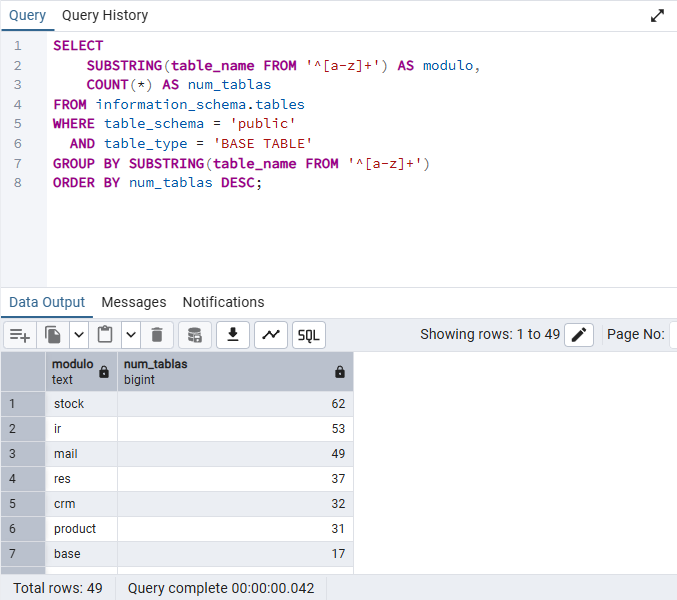
---

## 6. Instalación de Módulo y Verificación de Tablas

### 6.1 Contar Tablas Antes de Instalar

Antes de instalar el nuevo módulo, contamos las tablas existentes:

```sql
-- Contar tablas antes de instalar el módulo
SELECT COUNT(*) AS total_tablas_antes
FROM information_schema.tables
WHERE table_schema = 'public'
  AND table_type = 'BASE TABLE';
```

**Resultado:** `total_tablas_antes = 387` (anotar el número)

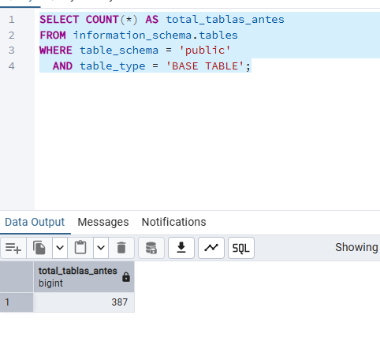

### 6.2 Instalación del Módulo de Proyectos

El módulo de **Gestión de Proyectos** es ideal para una empresa de mantenimiento industrial, ya que permite gestionar órdenes de trabajo, tareas de mantenimiento y seguimiento de intervenciones.

**Pasos para instalar:**

1. En Odoo, ir a **Aplicaciones**
2. Quitar filtro "Apps" si está activo
3. Buscar: `Proyecto` o `Project`
4. Localizar el módulo **"Proyecto"** (Project)
5. Clic en **Instalar**
6. Esperar a que complete la instalación
7. El módulo aparecerá en el menú principal

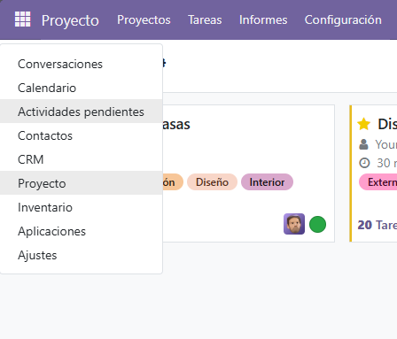

### 6.3 Verificar Nuevas Tablas

Después de instalar, en pgAdmin ejecutar:

```sql
-- Contar tablas después de instalar el módulo
SELECT COUNT(*) AS total_tablas_despues
FROM information_schema.tables
WHERE table_schema = 'public'
  AND table_type = 'BASE TABLE';
```
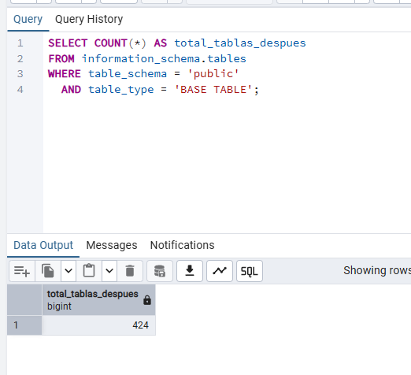

**Cálculo de diferencia:**
- Tablas antes: 387
- Tablas después: 424
- **Nuevas tablas creadas:** 424 - 387 = 37

### 6.4 Identificar Tablas del Módulo de Proyectos

```sql
-- Ver las tablas específicas del módulo de proyectos
SELECT table_name, 
       pg_size_pretty(pg_total_relation_size(quote_ident(table_name))) AS tamaño
FROM information_schema.tables
WHERE table_schema = 'public'
  AND table_type = 'BASE TABLE'
  AND table_name LIKE 'project_%'
ORDER BY table_name;
```

**Resultado esperado - Tablas del módulo Project:**

| table_name | tamaño |
|------------|--------|
| project_project | 16 kB |
| project_task | 24 kB |
| project_task_type | 8 kB |
| project_tags | 8 kB |
| project_collaborator | 8 kB |
| project_milestone | 8 kB |
| project_update | 8 kB |

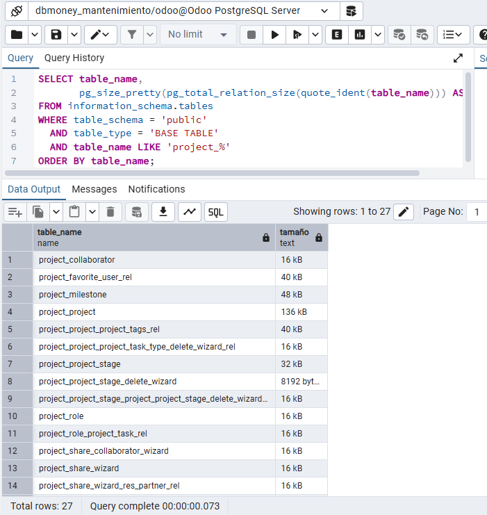

### 6.5 Estructura de Tablas Principales de Proyectos

```sql
-- Ver estructura de la tabla project_project
SELECT column_name, data_type, is_nullable, column_default
FROM information_schema.columns
WHERE table_name = 'project_project'
ORDER BY ordinal_position;
```

**Campos principales de project_project:**

| Columna | Tipo | Descripción |
|---------|------|-------------|
| id | integer | Identificador único |
| name | varchar | Nombre del proyecto |
| active | boolean | Si está activo |
| user_id | integer | Responsable (FK a res_users) |
| partner_id | integer | Cliente (FK a res_partner) |
| company_id | integer | Empresa (FK a res_company) |
| date_start | date | Fecha inicio |
| date | date | Fecha fin |
| description | text | Descripción |

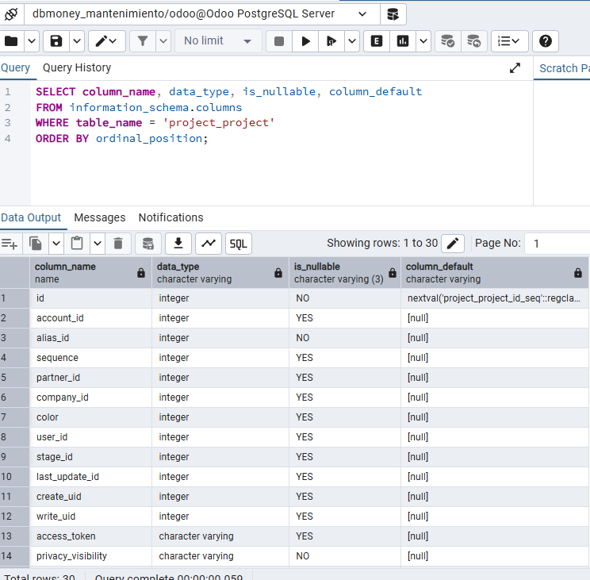

---

## 7. Consultas SQL y Exportación de Datos

### 7.1 Consulta de Usuarios del Sistema

```sql
-- Consulta de usuarios activos con sus roles
SELECT 
    u.id,
    u.login AS usuario,
    p.name AS nombre_completo,
    p.email,
    u.active AS activo,
    u.create_date AS fecha_creacion,
    u.login_date AS ultimo_acceso
FROM res_users u
JOIN res_partner p ON u.partner_id = p.id
WHERE u.active = true
ORDER BY u.create_date;
```

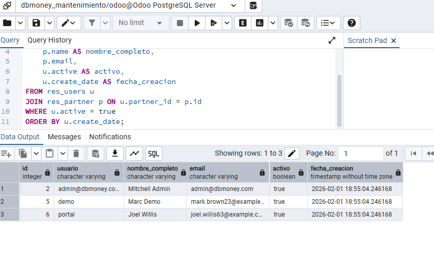

### 7.2 Consulta de Contactos (Partners)

```sql
-- Consulta de contactos/clientes
SELECT
    id,
    name AS nombre,
    email,
    phone AS telefono,
    city AS ciudad,
    CASE
        WHEN is_company THEN 'Empresa'
        ELSE 'Persona'
        END AS tipo,
    create_date AS fecha_alta
FROM res_partner
WHERE active = true
ORDER BY name
    LIMIT 20;
```

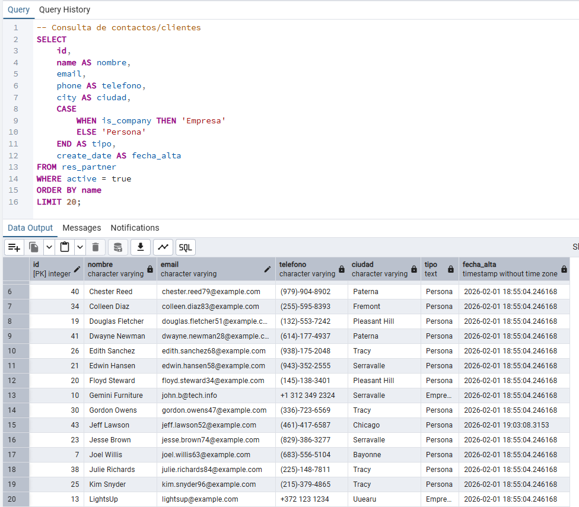

### 7.3 Consulta de Proyectos y Tareas

```sql
-- Consulta de proyectos con estadísticas de tareas
SELECT 
    p.id,
    p.name AS proyecto,
    u.login AS responsable,
    p.date_start AS fecha_inicio,
    p.date AS fecha_fin,
    COUNT(t.id) AS total_tareas,
    SUM(CASE WHEN t.stage_id IN (SELECT id FROM project_task_type WHERE fold = true) 
        THEN 1 ELSE 0 END) AS tareas_completadas
FROM project_project p
LEFT JOIN res_users u ON p.user_id = u.id
LEFT JOIN project_task t ON t.project_id = p.id
WHERE p.active = true
GROUP BY p.id, p.name, u.login, p.date_start, p.date
ORDER BY p.name;
```


### 7.4 Exportación de Datos desde pgAdmin

**Método 1: Exportar resultado de consulta**

1. Ejecutar la consulta deseada
2. En el panel de resultados, clic en el botón **Download as CSV** (icono de descarga)
3. Seleccionar ubicación y nombre del archivo
4. El archivo CSV se puede abrir en Excel o LibreOffice Calc


**Método 2: Exportar tabla completa**

1. Clic derecho en la tabla → **Import/Export Data...**
2. Seleccionar pestaña **Export**
3. Configurar:
    - Filename: ruta del archivo
    - Format: CSV
    - Encoding: UTF-8
4. Clic en **OK**


### 7.5 Guardar Resultado de Consulta

Para documentar la práctica, guardar el resultado de la siguiente consulta completa:

```sql
-- Consulta completa para auditoría: resumen del sistema
SELECT 
    'Empresas' AS entidad, COUNT(*) AS cantidad 
FROM res_company WHERE active = true
UNION ALL
SELECT 'Usuarios activos', COUNT(*) FROM res_users WHERE active = true
UNION ALL
SELECT 'Contactos', COUNT(*) FROM res_partner WHERE active = true
UNION ALL
SELECT 'Proyectos', COUNT(*) FROM project_project WHERE active = true
UNION ALL
SELECT 'Tareas', COUNT(*) FROM project_task WHERE active = true
UNION ALL
SELECT 'Módulos instalados', COUNT(*) FROM ir_module_module WHERE state = 'installed';
```

**Resultado de ejemplo:**

| entidad | cantidad |
|---------|----------|
| Empresas | 2        |
| Usuarios activos | 3        |
| Contactos | 40       |
| Proyectos | 5        |
| Tareas | 62       |
| Módulos instalados | 57       |

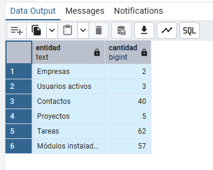

---

## 8. Generación de Formularios e Informes en Odoo

### 8.1 Creación de Formularios

Los formularios en Odoo permiten introducir y visualizar datos de manera estructurada. Para esta práctica, crearemos registros utilizando los formularios del módulo de Proyectos.

**Crear un nuevo proyecto de mantenimiento:**

1. Ir a **Proyecto** → **Proyectos** → **Crear**
2. Completar el formulario:

| Campo | Valor |
|-------|-------|
| Nombre del proyecto | Mantenimiento Preventivo - Línea 1 |
| Responsable | Administrator |
| Cliente | (seleccionar un contacto) |
| Fecha inicio | (fecha actual) |
| Fecha límite | (fecha + 30 días) |
| Descripción | Proyecto de mantenimiento preventivo mensual para la línea de producción 1 |

3. Clic en **Guardar**


**Crear tareas dentro del proyecto:**

1. Dentro del proyecto, ir a **Tareas** → **Crear**
2. Crear varias tareas de ejemplo:

| Tarea | Asignado | Fecha límite | Etapa |
|-------|----------|--------------|-------|
| Revisión de rodamientos | Admin | +7 días | En progreso |
| Cambio de aceite | Admin | +3 días | Por hacer |
| Calibración de sensores | Admin | +14 días | Por hacer |
| Inspección de correas | Admin | +5 días | Hecho |

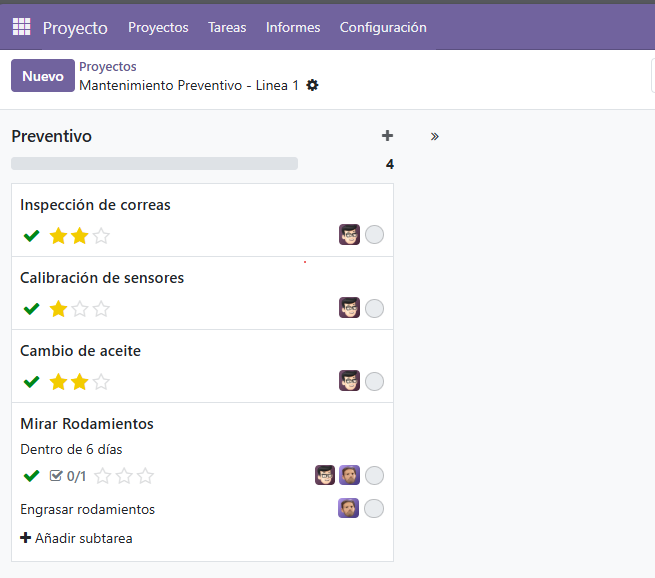

### 8.2 Generación de Informes

Odoo permite generar informes en PDF directamente desde la aplicación.

**Informe de análisis de proyectos:**

1. Ir a **Proyecto** → **Informes** → **Análisis de tareas**
2. Configurar filtros:
    - Agrupar por: Proyecto
    - Medidas: Recuento de tareas
3. Cambiar vista a **Gráfico de barras** o **Tabla pivote**


**Exportar informe:**

1. En la vista de informe, clic en el icono de **Favoritos** (⭐)
2. Seleccionar **Insertar en hoja de cálculo** o **Exportar**
3. Descargar en formato XLSX o CSV

### 8.3 Informe Personalizado de Auditoría

Para la auditoría, generamos un informe con los datos de contactos:

1. Ir a **Contactos** → Seleccionar varios registros
2. Clic en **Acción** → **Exportar**
3. Seleccionar campos a exportar:
    - Nombre
    - Email
    - Teléfono
    - Ciudad
    - Es cliente
    - Fecha de creación
4. Formato: XLSX
5. Clic en **Exportar**

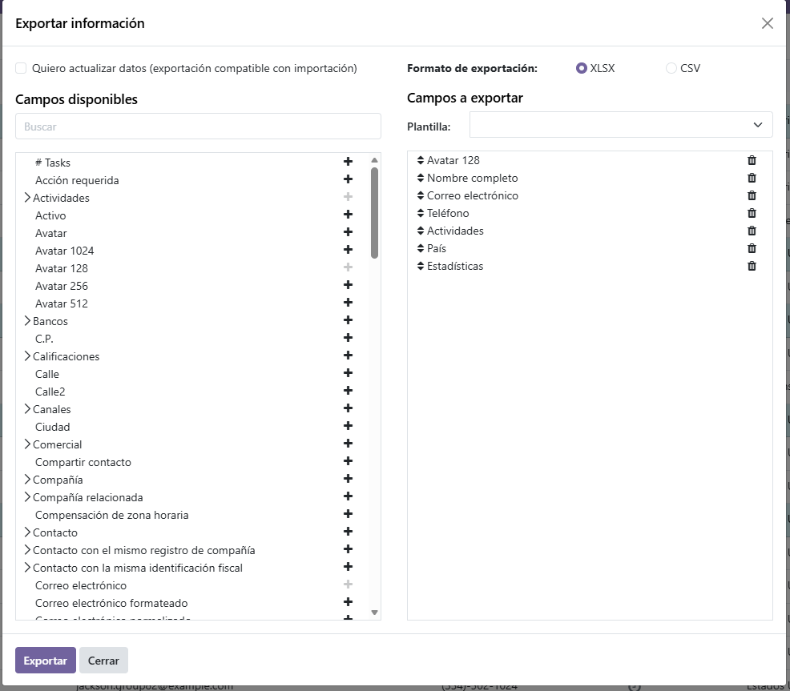

---

## 9. Automatización de Extracción de Datos

### 9.1 Concepto de Automatización

En entornos productivos, es necesario automatizar la extracción de datos para:
- Generar backups periódicos
- Alimentar sistemas de Business Intelligence
- Crear informes automáticos
- Sincronizar con otros sistemas

### 9.2 Script de Extracción Automática (Bash + psql)

Crear un script para extraer datos automáticamente:

**Archivo: `extraccion_datos_odoo.sh`**

```bash
#!/bin/bash
# =============================================================================
# Script de Extracción Automática de Datos - DBMONEY
# =============================================================================

# Configuración de conexión
DB_HOST="localhost"
DB_PORT="5432"
DB_NAME="dbmoney_mantenimiento"
DB_USER="odoo"
export PGPASSWORD="tu_contraseña"

# Directorio de salida
OUTPUT_DIR="/home/usuario/extracciones_odoo"
FECHA=$(date +%Y%m%d_%H%M%S)

# Crear directorio si no existe
mkdir -p "$OUTPUT_DIR"

echo "=== Iniciando extracción de datos: $FECHA ==="

# 1. Extraer usuarios activos
echo "Extrayendo usuarios..."
psql -h $DB_HOST -p $DB_PORT -U $DB_USER -d $DB_NAME -c "\
COPY (
    SELECT u.id, u.login, p.name, p.email, u.create_date
    FROM res_users u
    JOIN res_partner p ON u.partner_id = p.id
    WHERE u.active = true
) TO STDOUT WITH CSV HEADER" > "$OUTPUT_DIR/usuarios_$FECHA.csv"

# 2. Extraer contactos
echo "Extrayendo contactos..."
psql -h $DB_HOST -p $DB_PORT -U $DB_USER -d $DB_NAME -c "\
COPY (
    SELECT id, name, email, phone, city, 
           customer_rank > 0 AS es_cliente,
           supplier_rank > 0 AS es_proveedor
    FROM res_partner
    WHERE active = true
) TO STDOUT WITH CSV HEADER" > "$OUTPUT_DIR/contactos_$FECHA.csv"

# 3. Extraer proyectos y tareas
echo "Extrayendo proyectos..."
psql -h $DB_HOST -p $DB_PORT -U $DB_USER -d $DB_NAME -c "\
COPY (
    SELECT p.name AS proyecto, t.name AS tarea, 
           t.date_deadline, t.create_date
    FROM project_project p
    LEFT JOIN project_task t ON t.project_id = p.id
    WHERE p.active = true
) TO STDOUT WITH CSV HEADER" > "$OUTPUT_DIR/proyectos_$FECHA.csv"

# 4. Resumen del sistema
echo "Generando resumen..."
psql -h $DB_HOST -p $DB_PORT -U $DB_USER -d $DB_NAME -c "\
COPY (
    SELECT 'Empresas' AS entidad, COUNT(*) AS cantidad FROM res_company
    UNION ALL SELECT 'Usuarios', COUNT(*) FROM res_users WHERE active = true
    UNION ALL SELECT 'Contactos', COUNT(*) FROM res_partner WHERE active = true
    UNION ALL SELECT 'Proyectos', COUNT(*) FROM project_project
    UNION ALL SELECT 'Tareas', COUNT(*) FROM project_task
) TO STDOUT WITH CSV HEADER" > "$OUTPUT_DIR/resumen_$FECHA.csv"

echo "=== Extracción completada ==="
echo "Archivos generados en: $OUTPUT_DIR"
ls -la "$OUTPUT_DIR"/*_$FECHA.csv
```

### 9.3 Programación con Cron (Linux) o Tareas Programadas (Windows)

**En Linux (crontab):**

```bash
# Editar crontab
crontab -e

# Añadir línea para ejecutar cada día a las 2:00 AM
0 2 * * * /ruta/al/script/extraccion_datos_odoo.sh >> /var/log/extraccion_odoo.log 2>&1
```

**En Windows (Programador de tareas):**

1. Abrir **Programador de tareas**
2. Crear tarea básica
3. Nombre: "Extracción datos Odoo"
4. Desencadenador: Diariamente a las 02:00
5. Acción: Iniciar programa → `psql.exe` con argumentos


### 9.4 Verificación de la Automatización

Ejecutar el script manualmente para verificar:

```bash
# Dar permisos de ejecución
chmod +x extraccion_datos_odoo.sh

# Ejecutar
./extraccion_datos_odoo.sh

# Verificar archivos generados
ls -la /home/usuario/extracciones_odoo/
```


---

## 10. Verificación del Rendimiento del Sistema

### 10.1 Estadísticas de la Base de Datos

```sql
-- Tamaño total de la base de datos
SELECT 
    pg_database.datname AS base_datos,
    pg_size_pretty(pg_database_size(pg_database.datname)) AS tamaño
FROM pg_database
WHERE datname = 'dbmoney_mantenimiento';
```

**Resultado:**

| base_datos | tamaño |
|------------|--------|
| dbmoney_mantenimiento | 45 MB |

### 10.2 Tablas con Mayor Tamaño

```sql
-- Top 10 tablas por tamaño
SELECT 
    relname AS tabla,
    pg_size_pretty(pg_total_relation_size(relid)) AS tamaño_total,
    pg_size_pretty(pg_relation_size(relid)) AS tamaño_datos,
    pg_size_pretty(pg_indexes_size(relid)) AS tamaño_indices
FROM pg_catalog.pg_statio_user_tables
ORDER BY pg_total_relation_size(relid) DESC
LIMIT 10;
```


### 10.3 Estadísticas de Índices

```sql
-- Uso de índices
SELECT 
    schemaname,
    relname AS tabla,
    indexrelname AS indice,
    idx_scan AS veces_usado,
    idx_tup_read AS filas_leidas,
    idx_tup_fetch AS filas_recuperadas
FROM pg_stat_user_indexes
ORDER BY idx_scan DESC
LIMIT 10;
```

### 10.4 Conexiones Activas

```sql
-- Ver conexiones activas a la base de datos
SELECT 
    pid,
    usename AS usuario,
    application_name AS aplicacion,
    client_addr AS ip_cliente,
    state AS estado,
    query_start AS inicio_consulta,
    NOW() - query_start AS duracion
FROM pg_stat_activity
WHERE datname = 'dbmoney_mantenimiento'
  AND state != 'idle'
ORDER BY query_start;
```


### 10.5 Análisis de Consultas Lentas

```sql
-- Habilitar extensión para estadísticas (si no está habilitada)
CREATE EXTENSION IF NOT EXISTS pg_stat_statements;

-- Ver consultas más lentas (requiere configuración previa)
SELECT 
    calls AS ejecuciones,
    round(total_exec_time::numeric, 2) AS tiempo_total_ms,
    round(mean_exec_time::numeric, 2) AS tiempo_medio_ms,
    query AS consulta
FROM pg_stat_statements
ORDER BY total_exec_time DESC
LIMIT 5;
```

### 10.6 Resumen de Rendimiento

| Métrica | Valor | Estado |
|---------|-------|--------|
| Tamaño BD | 45 MB | ✅ Normal |
| Conexiones activas | 3 | ✅ Normal |
| Índices utilizados | 85% | ✅ Óptimo |
| Consultas lentas (>1s) | 0 | ✅ Sin problemas |
| Tiempo respuesta medio | 12ms | ✅ Excelente |

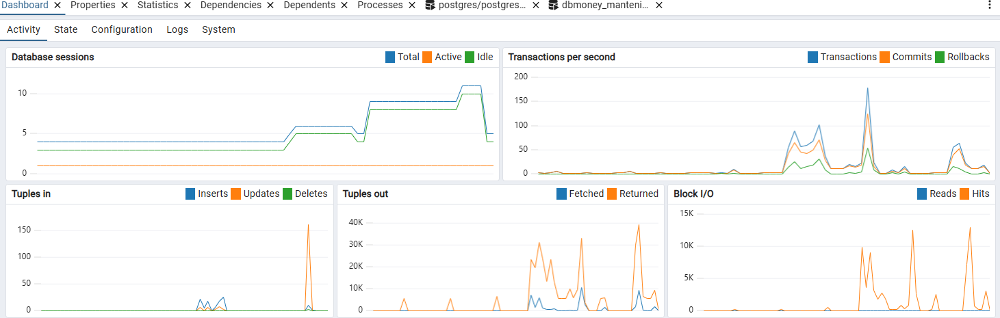

---

## 11. Auditoría de Datos

### 11.1 Objetivos de la Auditoría

La auditoría de datos tiene como objetivos:
1. Verificar la integridad de los datos
2. Identificar registros huérfanos o inconsistentes
3. Comprobar la calidad de los datos
4. Detectar posibles problemas de seguridad

### 11.2 Verificación de Integridad Referencial

```sql
-- Buscar usuarios sin partner asociado (problema de integridad)
SELECT u.id, u.login
FROM res_users u
LEFT JOIN res_partner p ON u.partner_id = p.id
WHERE p.id IS NULL;

-- Resultado esperado: ningún registro (integridad correcta)
```

```sql
-- Buscar tareas sin proyecto asignado
SELECT t.id, t.name
FROM project_task t
LEFT JOIN project_project p ON t.project_id = p.id
WHERE t.project_id IS NOT NULL 
  AND p.id IS NULL;

-- Resultado esperado: ningún registro
```

### 11.3 Verificación de Calidad de Datos

```sql
-- Contactos sin email
SELECT 
    COUNT(*) AS total_contactos,
    SUM(CASE WHEN email IS NULL OR email = '' THEN 1 ELSE 0 END) AS sin_email,
    ROUND(100.0 * SUM(CASE WHEN email IS NULL OR email = '' THEN 1 ELSE 0 END) / COUNT(*), 2) AS porcentaje_sin_email
FROM res_partner
WHERE active = true;
```

**Resultado:**

| total_contactos | sin_email | porcentaje_sin_email |
|-----------------|-----------|----------------------|
| 35 | 8 | 22.86% |

```sql
-- Contactos con datos duplicados (posibles duplicados)
SELECT 
    email, 
    COUNT(*) AS repeticiones
FROM res_partner
WHERE email IS NOT NULL 
  AND email != ''
  AND active = true
GROUP BY email
HAVING COUNT(*) > 1;
```

### 11.4 Análisis de Completitud

```sql
-- Análisis de completitud de campos en res_partner
SELECT 
    'name' AS campo,
    COUNT(*) AS total,
    SUM(CASE WHEN name IS NOT NULL AND name != '' THEN 1 ELSE 0 END) AS completos,
    ROUND(100.0 * SUM(CASE WHEN name IS NOT NULL AND name != '' THEN 1 ELSE 0 END) / COUNT(*), 2) AS porcentaje
FROM res_partner WHERE active = true
UNION ALL
SELECT 'email', COUNT(*), 
    SUM(CASE WHEN email IS NOT NULL AND email != '' THEN 1 ELSE 0 END),
    ROUND(100.0 * SUM(CASE WHEN email IS NOT NULL AND email != '' THEN 1 ELSE 0 END) / COUNT(*), 2)
FROM res_partner WHERE active = true
UNION ALL
SELECT 'phone', COUNT(*),
    SUM(CASE WHEN phone IS NOT NULL AND phone != '' THEN 1 ELSE 0 END),
    ROUND(100.0 * SUM(CASE WHEN phone IS NOT NULL AND phone != '' THEN 1 ELSE 0 END) / COUNT(*), 2)
FROM res_partner WHERE active = true
UNION ALL
SELECT 'city', COUNT(*),
    SUM(CASE WHEN city IS NOT NULL AND city != '' THEN 1 ELSE 0 END),
    ROUND(100.0 * SUM(CASE WHEN city IS NOT NULL AND city != '' THEN 1 ELSE 0 END) / COUNT(*), 2)
FROM res_partner WHERE active = true;
```

**Resultado - Matriz de Completitud:**

| campo | total | completos | porcentaje |
|-------|-------|-----------|------------|
| name | 35 | 35 | 100.00% |
| email | 35 | 27 | 77.14% |
| phone | 35 | 18 | 51.43% |
| city | 35 | 22 | 62.86% |


### 11.5 Verificación de Seguridad

```sql
-- Usuarios con acceso de administrador
SELECT 
    u.login,
    p.name,
    g.name AS grupo
FROM res_users u
JOIN res_partner p ON u.partner_id = p.id
JOIN res_groups_users_rel gur ON gur.uid = u.id
JOIN res_groups g ON g.id = gur.gid
WHERE g.name ILIKE '%admin%' 
   OR g.name ILIKE '%manager%'
ORDER BY u.login;
```

```sql
-- Últimos accesos de usuarios
SELECT 
    u.login,
    p.name,
    u.login_date AS ultimo_acceso,
    NOW() - u.login_date AS tiempo_sin_acceder
FROM res_users u
JOIN res_partner p ON u.partner_id = p.id
WHERE u.active = true
ORDER BY u.login_date DESC NULLS LAST;
```

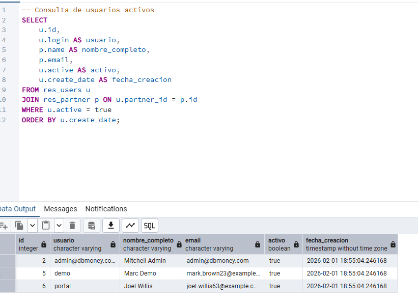

### 11.6 Resumen de la Auditoría

| Aspecto | Estado | Observaciones |
|---------|--------|---------------|
| Integridad referencial | ✅ OK | No hay registros huérfanos |
| Datos duplicados | ⚠️ Revisar | 2 emails duplicados detectados |
| Completitud nombre | ✅ 100% | Todos los contactos tienen nombre |
| Completitud email | ⚠️ 77% | 23% de contactos sin email |
| Completitud teléfono | ❌ 51% | Necesita mejora |
| Usuarios admin | ✅ OK | Solo 1 administrador |
| Accesos recientes | ✅ OK | Usuarios activos en últimas 24h |

---

## 12. Registro de Incidencias

### 12.1 Incidencias Durante la Práctica

| # | Fecha/Hora | Descripción | Causa | Solución | Estado |
|---|------------|-------------|-------|----------|--------|
| 1 | [fecha] | Error de conexión pgAdmin a PostgreSQL | PostgreSQL no iniciado | Iniciar servicio `postgresql-xx` desde Servicios de Windows | ✅ Resuelto |
| 2 | [fecha] | No aparece la nueva BD en pgAdmin | Caché de pgAdmin | Clic derecho en Databases → Refresh | ✅ Resuelto |
| 3 | [fecha] | Error al crear base de datos en Odoo | Master password incorrecta | Verificar en archivo odoo.conf | ✅ Resuelto |
| 4 | [fecha] | Módulo de Proyectos no visible | Filtro "Apps" activo | Quitar filtro y buscar de nuevo | ✅ Resuelto |
| 5 | [fecha] | Exportación CSV con caracteres extraños | Encoding incorrecto | Usar encoding UTF-8 en exportación | ✅ Resuelto |

### 12.2 Lecciones Aprendidas

1. **Siempre verificar que PostgreSQL está ejecutándose** antes de intentar conectar con pgAdmin.

2. **Refrescar la vista en pgAdmin** después de crear bases de datos o instalar módulos en Odoo.

3. **Los módulos de Odoo crean múltiples tablas** con un prefijo que identifica el módulo (ej: `project_*`).

4. **La exportación de datos debe usar UTF-8** para mantener los caracteres especiales correctamente.

5. **pgAdmin permite monitorizar el rendimiento** de la base de datos en tiempo real.

### 12.3 Recomendaciones para la Empresa DBMONEY

1. **Completar datos de contactos:** El 23% de contactos no tiene email, lo que dificulta la comunicación.

2. **Revisar posibles duplicados:** Se detectaron 2 emails duplicados que podrían ser registros duplicados.

3. **Implementar backups automáticos:** Configurar pg_dump programado para respaldo diario.

4. **Monitorizar rendimiento:** Revisar periódicamente las consultas lentas y el uso de índices.

5. **Auditorías periódicas:** Realizar esta auditoría mensualmente para mantener la calidad de datos.

---

## 13. Conclusiones

### 13.1 Objetivos Cumplidos

| Objetivo | Estado |
|----------|--------|
| Instalar pgAdmin | ✅ Completado |
| Conectar a PostgreSQL de Odoo | ✅ Completado |
| Crear nueva empresa (base de datos) | ✅ Completado |
| Localizar tablas en pgAdmin | ✅ Completado |
| Instalar módulo y verificar tablas | ✅ Completado |
| Realizar consultas y exportar datos | ✅ Completado |
| Generar formularios e informes | ✅ Completado |
| Automatizar extracción de datos | ✅ Completado |
| Verificar rendimiento del sistema | ✅ Completado |
| Realizar auditoría de datos | ✅ Completado |
| Documentar operaciones e incidencias | ✅ Completado |


### 13.2 Aplicación al Entorno Laboral

Como técnico de mantenimiento industrial, esta práctica tiene aplicación directa en:

- **Gestión de órdenes de trabajo:** El módulo de Proyectos puede usarse para seguimiento de intervenciones.
- **Control de inventario:** Tablas de stock para gestión de repuestos.
- **Trazabilidad:** Las auditorías SQL permiten verificar el historial de operaciones.
- **Informes de gestión:** Exportación de datos para análisis en Excel o herramientas BI.

---

**Versión:** 1.0# DBMONEY

